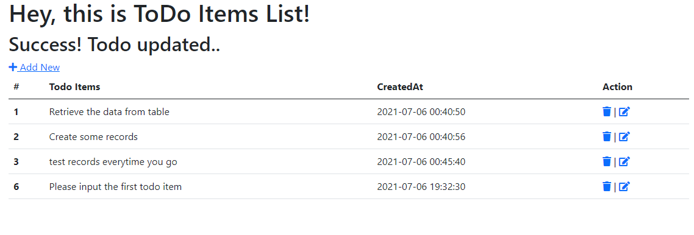

## ToDo Items

Simple ToDo List!

http://127.0.0.1:8000/todoitems_show

## Some useful commands

php artisan serve

php artisan make:model Todoitems -mcr
php artisan migrate
php artisan route:cache

## Screenshots

### References
YouTube Channel: Programming with Vishal
<a href="https://www.youtube.com/watch?v=OR0bISR3G3M" target="_balnk">Simple Laravel 7 CRUD (Create, Read, Update, Delete) Operation</a>
